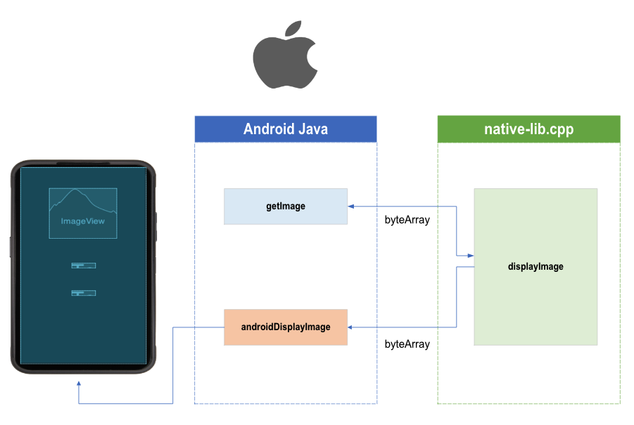
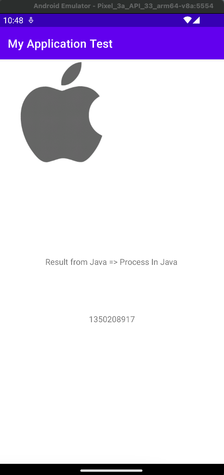

# Android_Java_JNI_Pass_Parameter
## Files Path
* Image Path
  * ./Android_Java_JNI_Pass_Parameter/MyApplicationTest/app/src/main/res/drawable/apple.png
* UI XML
  * ./Android_Java_JNI_Pass_Parameter/MyApplicationTest/app/src/main/res/layout/activity_main.xml
* Java
  * ./Android_Java_JNI_Pass_Parameter/MyApplicationTest/app/src/main/java/com/example/myapplicationtest/MainActivity.java
* native-lib.cpp
  * ./Android_Java_JNI_Pass_Parameter/MyApplicationTest/app/src/main/cpp/native-lib.cpp

## Pic

